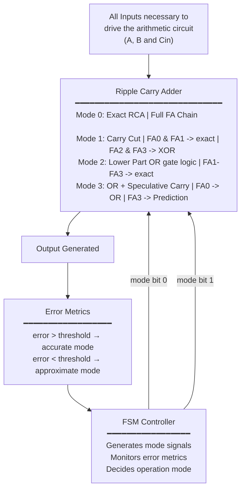

# Approximate Arithmetic Design using Dynamic and Runtime Techniques

 
 

## Functional Block Diagram

```mermaid
flowchart TD
    Input["All Inputs necessary to <br/>drive the arithmetic circuit<br/>(A, B and Cin)"]
    
    RCA["Ripple Carry Adder<br/>━━━━━━━━━━━━━━━━━━━━━━━━━━━━━━<br/>Mode 0: Exact RCA | Full FA Chain                                           <br/>Mode 1: Carry Cut | FA0 & FA1 -> exact | FA2 & FA3 -> XOR      <br/>Mode 2: Lower Part OR gate logic | FA1-FA3 -> exact                <br/>Mode 3: OR + Speculative Carry | FA0 -> OR | FA3 -> Prediction"]
    
    Output["Output Generated"]
    
    Error["Error Metrics<br/>━━━━━━━━━━━━━━━━━━<br/>error > threshold → accurate mode<br/>error < threshold → approximate mode"]
    
    FSM["FSM Controller<br/>━━━━━━━━━━━━━━━━━<br/>Generates mode signals<br/>Monitors error metrics<br/>Decides operation mode"]
    
    Input --> RCA
    FSM -->|mode bit 0| RCA
    FSM -->|mode bit 1| RCA
    RCA --> Output
    Output --> Error
    Error --> FSM
```

