# Approximate Arithmetic Design using Dynamic and Runtime Techniques
Approximate computing is a way to save power and resources by allowing a trade-off in accuracy. Most existing designs use a fixed level of approximation, which makes them less flexible.

This project proposes **dynamic techniques** with a **runtime-configurable arithmetic unit** that can switch between exact and approximate modes depending on what the system needs or performance constraints. This makes the design more energy-efficient, faster, and still good enough in terms of output quality, which can be useful for many applications.


To demonstrate this, I have tried implementing the technique on a 4-bit Ripple Carry Adder (RCA) and a 16-bit RCA, with their simulation outputs/reports included in the repository.

This project is still under development, and I’m still trying to have better control over power, delay, and accuracy trade-offs 😅.

<br>

## Functional Block Diagram

```mermaid
flowchart TD
    Input["All Inputs necessary to <br/>drive the arithmetic circuit<br/>(A, B and Cin)"]
    
    RCA["Ripple Carry Adder<br/>━━━━━━━━━━━━━━━━━━━━━━━━━━━━━━<br/>Mode 0: Exact RCA | Full FA Chain                                           <br/>Mode 1: Carry Cut | FA0 & FA1 -> exact | FA2 & FA3 -> XOR      <br/>Mode 2: Lower Part OR gate logic | FA1-FA3 -> exact                <br/>Mode 3: OR + Speculative Carry | FA0 -> OR | FA3 -> Prediction"]
    
    Output["Output Generated"]
    
    Error["Error Metrics<br/>━━━━━━━━━━━━━━━━━━<br/>error > threshold → accurate mode<br/>error < threshold → approximate mode"]
    
    FSM["FSM Controller<br/>━━━━━━━━━━━━━━━━━<br/>Generates mode signals<br/>Monitors error metrics<br/>Decides operation mode"]
    
    Input --> RCA
    FSM -->|mode bit 0| RCA
    FSM -->|mode bit 1| RCA
    RCA --> Output
    Output --> Error
    Error --> FSM
```



## Working
```
FSM Controller
|
|_ Inputs: user-defined mode, quality estimate/application requirements and runtime feedback from the error monitor.
|
|_ Output control signals: mode[1:0] (00 = Exact, 01 = Mode1, 10 = Mode2, 11 = Mode3), along with carry_cut_en, or_en, and spec_pred_en.


Control Signal Distribution
|
|_ These signals control multiplexers and enables inside the 4-bit and 16-bit RCA, allowing it to reconfigure dynamically without resynthesis.


Error Monitor
|
|_ Continuously compares Approx Sum vs Exact Sum.
|_ If error > threshold → FSM switches to a more accurate mode.
|_ If error < threshold → FSM allows more approximation for better speed/power.

```
